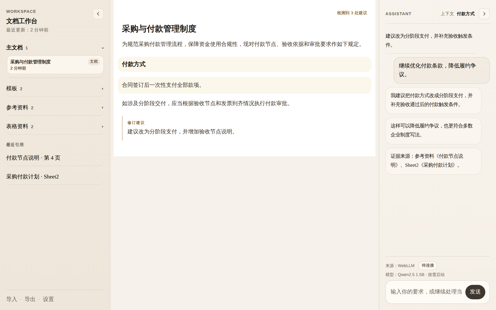

# 本地文书工作台

一个完全运行在浏览器本地的文书工作台，面向各类固定结构、需要严谨产出的正式文书场景。产品明确围绕两条主线展开：

- **文书生成**：基于模板和背景资料自动装配初稿
- **文书审阅**：对已有文书进行校阅、风险检查和修订建议

两条主线共用同一套导入、预览、检索、本地模型和导出底座。

## 核心特性

- 🔒 **完全离线**：所有文档内容、索引和生成结果仅保存在本机，不上传云端
- 🤖 **本地 AI**：基于 WebGPU + Qwen 系列模型，在浏览器内完成文档生成和审阅
- 📄 **Word 原生**：支持 `.docx` 格式导入导出，保留标题、编号、表格等结构
- 🔍 **智能检索**：浏览器端向量检索，可追溯生成结论的资料来源
- 🧩 **模板驱动初稿**：基于模板、固定句式和背景资料，先由系统装配 80% 初稿，再由人工确认剩余 20%
- 🩺 **文书审阅校阅**：围绕已有文书识别用词、标点、语法、逻辑、事实完整性和条款风险问题
- ⚙️ **本地设置**：支持统一管理提示词偏好、主题色和本地模型，并在当前浏览器内持久化
- ⚡ **现代架构**：React + TypeScript + Vite，流畅的开发和使用体验

## 技术栈

| 组件 | 技术 | 说明 |
|------|------|------|
| 生成引擎 | `@mlc-ai/web-llm` | WebGPU 加速的浏览器内 LLM 推理 |
| 本地模型 | Qwen2.5-1.5B 等| 中文文档任务优化的轻量模型 |
| 向量检索 | `@huggingface/transformers` + `voy-search` | 浏览器端嵌入生成、相似度检索与重排 |
| PDF 抽取 | `pdfjs-dist` | 保留阅读顺序的文本提取与分页预览 |
| DOCX 抽取 | `DecompressionStream` + XML 解析 | 浏览器原生解包 `.docx`，减少额外依赖 |
| 文档导出 | `docx` / `docxtemplater` | 生成规范 Word 文件 |
| 持久化 | IndexedDB | 离线存储文档、索引和模型缓存 |
| 前端框架 | React 19 + TypeScript | 类型安全的现代 UI |
| 状态管理 | Zustand | 轻量级全局状态 |
| 构建工具 | Vite + Bun | 快速开发和打包 |

## 快速开始

### 环境要求

- Node.js 18+ / Bun 1.3+
- 支持 WebGPU 的浏览器（Chrome 113+、Edge 113+ 等现代桌面浏览器）

### 安装运行

```bash
# 安装依赖
bun install

# 开发模式
bun run dev

# 构建生产版本
bun run build

# 预览构建结果
bun run preview

# 运行测试
bun run test
```

## 页面预览

当前主工作台会在推送到主分支后由 GitHub Actions 自动截图，并更新下面这张预览图。

### 主工作台



## 项目结构

```
.
├── src/
│   ├── app/              # 应用入口、路由、全局样式
│   ├── features/         # 功能模块
│   │   ├── assistant-panel/   # AI 助手面板
│   │   ├── editor-draft/      # 文档编辑器
│   │   ├── workspace-context/ # 上下文管理
│   │   └── workspace-shell/   # 工作区外壳
│   ├── services/         # 核心服务
│   │   ├── ai/           # AI 推理服务
│   │   ├── export/       # 文档导出
│   │   ├── import/       # 文档导入
│   │   └── persistence/  # 数据持久化
│   ├── shared/           # 共享工具和组件
│   └── tests/            # 测试文件
├── .planning/            # 项目规划和文档
├── docs/                 # 用户文档
└── index.html            # 应用入口
```

## 两条产品主线

### 1. 文书生成

适用于：

- 行政文书
- 合同、协议
- 制度、通知、函件
- 采购说明、申请材料

核心过程：

模板 -> 背景资料 -> 字段映射 -> 固定句式装配 -> 待确认项标注 -> 初稿导出

### 2. 文书审阅

适用于：

- 对已有文书做校对校阅
- 检查逻辑不清、事实缺失、条款风险
- 给出直接改写或润色建议

核心过程：

已有文书 -> 结构提取 -> 问题识别 -> 定位原文 -> 修订建议 -> 确认导出

## 共享底座流程

```
┌─────────┐    ┌─────────┐    ┌─────────┐    ┌─────────┐    ┌─────────┐    ┌─────────┐
│  导入   │ →  │  检索   │ →  │  生成   │ →  │  审阅   │ →  │  修订   │ →  │  导出   │
│ 资料库  │    │ 上下文  │    │ 初稿    │    │ 风险    │    │ 条款    │    │ Word    │
└─────────┘    └─────────┘    └─────────┘    └─────────┘    └─────────┘    └─────────┘
```

### 1. 导入
支持 `.docx`、`.pdf`、`.txt`、`.md` 等格式，自动提取结构并存入本地索引

### 2. 检索
基于向量相似度检索相关段落，为生成和审阅提供上下文。当前技术路线进一步明确为：

- `PDF text extraction`：使用 `pdfjs-dist` 保留阅读顺序提取文本
- `DOCX extraction`：优先走浏览器原生 `DecompressionStream + XML parse`
- `Chunking`：按句边界切块，采用滑动窗口与 `50% overlap`
- `Embedding`：使用 `all-MiniLM-L6-v2`，通过 Transformers.js 在 Worker 中运行
- `Search`：先做 Voy cosine search，再做 MMR 重排，减少重复片段
- `Cache`：向量和索引元数据持久化到 IndexedDB，刷新页面后可直接复用

### 3. 文书生成
模板驱动的结构化文书生成

### 模板驱动初稿生成

这里的“生成”不是让模型自由写一篇文档，而是把固定格式的业务文书从“人工拼装”变成“系统先装好 80%，人再确认最后 20%”。

系统会围绕下面四件事工作：

1. 识别模板结构
   - 模板里有哪些固定章节、字段、条件段落和固定句式
2. 提取背景资料
   - 从导入的文档、表格和文本资料里抽取姓名、日期、金额、地点、事实描述等信息
3. 自动装配初稿
   - 把已知信息填进模板，按规则拼出章节内容
4. 标注待确认项
   - 缺失信息、不确定内容和需要人工确认的地方会明确标出，不允许无依据编造

最终输出的是一份：

- 结构完整
- 来源可追溯
- 可继续编辑审阅
- 可导出为 Word

的正式初稿，而不是一段普通聊天式回答。

### 4. 文书审阅
识别潜在风险条款，提供修改建议和依据来源

### 5. 修订确认
接受/拒绝修订建议，追溯每条建议的资料来源

### 6. 导出
生成结构完整、可直接交付的 `.docx` 文件

## 设置页

当前设置页负责三类全局偏好：

- `提示词偏好`：控制审阅、改写、润色时的默认风格和关注重点
- `主题色`：统一切换工作台配色
- `本地模型`：搜索、选择并持久化当前浏览器要使用的模型

这些设置保存在当前浏览器里，刷新页面后会自动恢复。

## 浏览器兼容性

| 浏览器 | 版本 | 支持情况 |
|--------|------|----------|
| Chrome | 113+ | ✅ 完全支持 |
| Edge | 113+ | ✅ 完全支持 |
| Firefox | 128+ | ⚠️ 需开启 WebGPU 标志 |
| Safari | 18.2+ | ⚠️ 实验性支持 |

## 隐私说明

本项目设计原则是**数据不出端**：

- 所有文档内容仅存储在本地 IndexedDB
- AI 推理完全在浏览器内运行，不发送任何数据到服务器
- 向量索引和检索均在本地完成
- 可选导出文件到本地文件系统

## 开发路线

详见 [ROADMAP.md](.planning/ROADMAP.md)

- [x] 项目初始化和基础架构
- [x] 核心依赖集成
- [ ] 文档导入和解析
- [ ] 本地模型加载和推理
- [ ] 向量检索和索引
- [ ] 文档生成工作流
- [ ] 审阅和风险检测
- [ ] Word 导出功能

## 许可证

MIT License

## 贡献

欢迎提交 Issue 和 Pull Request！

---

**注意**：本项目处于早期开发阶段，部分功能可能尚未完成。
